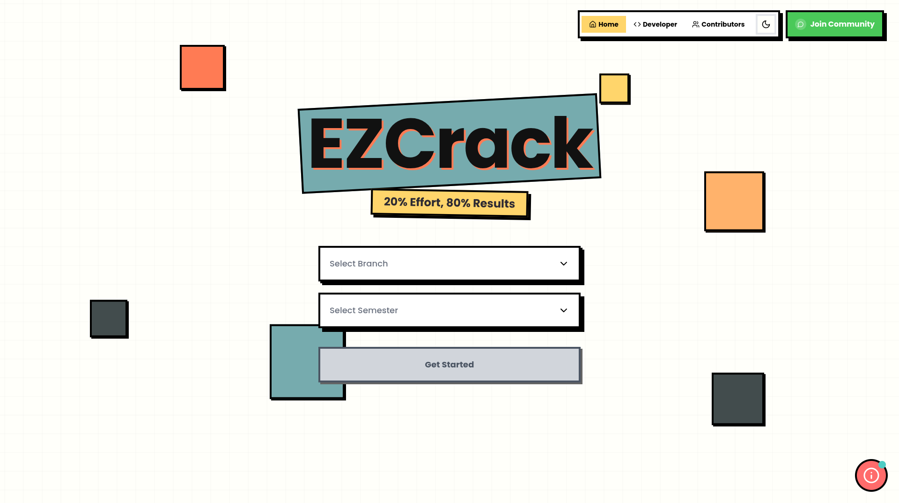
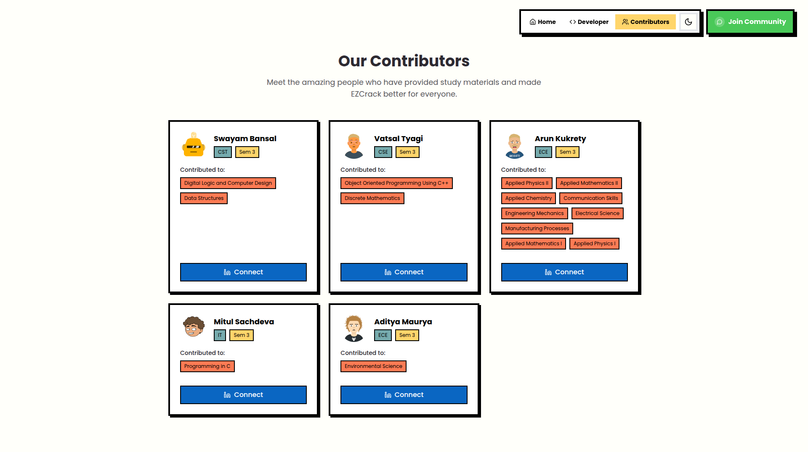
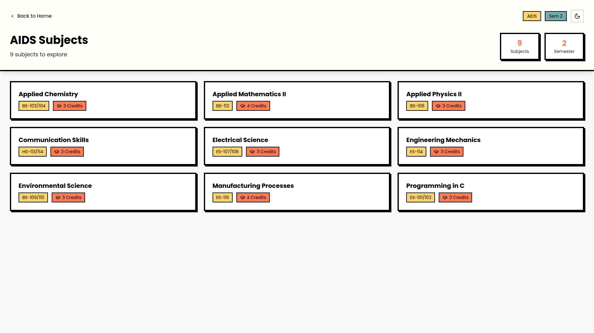
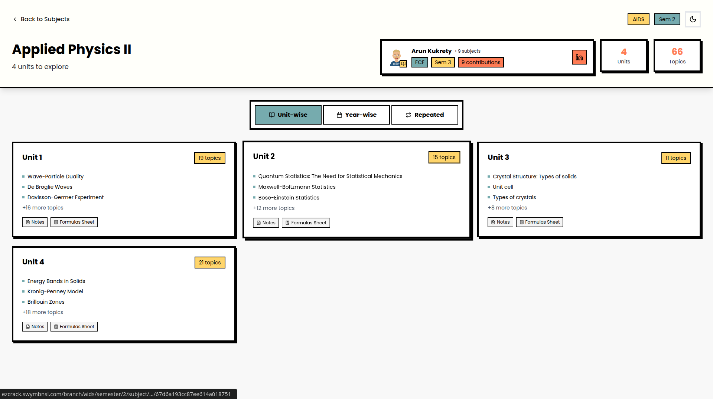
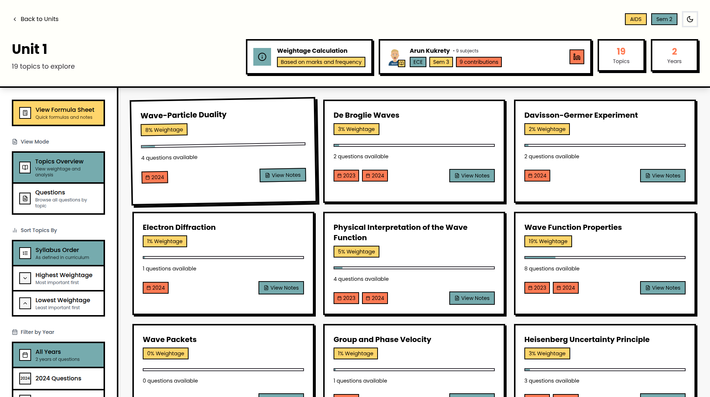
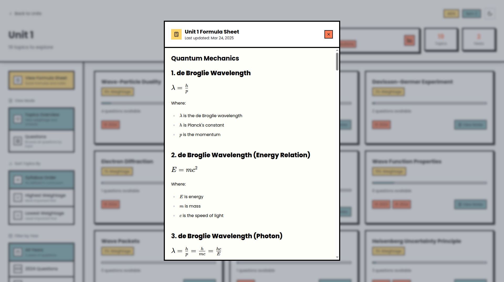

<a href="https://github.com/05Ashish/EZCrack">
<p align="center">
    
  </a>
<br/>
  <h3 align="center">EZCrack</h3>

<div align="center">


[](https://github.com/prettier/prettier)


</div>
<p align="center">
    20% Effort, 80% Results
    <br/>
    <br/>
    <a href="https://ezcrack.05Ashish.com/">View Demo</a>
    .
    <a href="https://github.com/05Ashish/EZCrack/issues">Report Bug</a>
    .
    <a href="https://github.com/05Ashish/EZCrack/issues">Request Feature</a>
  </p>
</p>

## Table Of Contents

- [Table Of Contents](#table-of-contents)
- [About The Project](#about-the-project)
- [Why EZCrack?](#why-ezcrack)
- [Features](#features)
- [Built With](#built-with)
- [Getting Started](#getting-started)
  - [Prerequisites](#prerequisites)
  - [Installation](#installation)
  - [Local Development](#local-development)
  - [Environment Variables](#environment-variables)
- [Contributing](#contributing)
  - [Creating A Pull Request](#creating-a-pull-request)
- [Raising An Issue](#raising-an-issue)
- [License](#license)
- [Screenshots](#screenshots)
  - [Home Page](#home-page)
  - [Contributors Page](#contributors-page)
  - [Branch and Semester Page](#branch-and-semester-page)
  - [Subject Page](#subject-page)
  - [Repeated Questions](#repeated-questions)
  - [Unit Page](#unit-page)
  - [Formula Sheet](#formula-sheet)
- [Authors](#authors)

## About The Project



EZCrack is a one-stop platform for IPU students to get instant access to:

- Weightage-wise topic breakdown
- Most repeated questions (concept-based and pattern-based)
- Accurate, curriculum-aligned notes
- Crisp formula sheets
- Topic-wise & year-wise PYQs

## Why EZCrack?

When I joined MAIT, I realized that IPU exams mainly consist of repeated PYQs, but there was no way of knowing which PYQs are repeated, which topics are asked frequently, and which topics can be skipped.

There was only one way: a one-stop platform with smart analysis of all PYQs. And that's exactly what EZCrack does. EZCrack analyzes PYQs and tells you the bare minimum you need to study to score the maximum marks.

Not just this, it provides formula sheets and topic-wise notes so that users can study topics selectively. Hence the tagline: <b>20% Effort, 80% Results.</b>

## Features

✨ **Smart Organization**

- Branch-wise and semester-wise categorization
- Subject and unit-based navigation
- Topic-wise question filtering

📊 **Advanced Analytics**

- Weightage calculation for each topic
- Question frequency analysis
- Year-wise question distribution
- Repeated question patterns (concept & pattern-based)

📝 **Rich Content**

- Previous year question papers with answers
- Formula sheets for quick revision
- Topic-wise notes
- Markdown support with KaTeX for mathematical equations

🎯 **User-Friendly Features**

- Dark/Light theme toggle
- Responsive design for all devices
- Advanced filtering (by year, exam type)
- Multiple view modes (yearwise, repeated questions)
- Search and sort functionality

🤝 **Community Driven**

- Contributor system for content management
- Open-source and collaborative

## Built With

EZCrack is built using modern web technologies:

- [Next.js 15](https://nextjs.org) - React framework for production
- [TypeScript](https://www.typescriptlang.org/) - Type-safe JavaScript
- [TailwindCSS](https://tailwindcss.com/) - Utility-first CSS framework
- [MongoDB](https://www.mongodb.com/) - NoSQL database
- [Framer Motion](https://www.framer.com/motion/) - Animation library
- [Mongoose](https://mongoosejs.com/) - MongoDB object modeling
- [React Markdown](https://github.com/remarkjs/react-markdown) - Markdown rendering
- [KaTeX](https://katex.org/) - Mathematical equation rendering
- [Lucide React](https://lucide.dev/) - Beautiful icon library

## Getting Started

### Prerequisites

<a href="https://git-scm.com/downloads">Git</a> - A distributed version control system for tracking changes in source code during software development.

<a href="https://nodejs.org/">Node.js</a> - JavaScript runtime built on Chrome's V8 JavaScript engine. (v18 or higher recommended)

<a href="https://www.npmjs.com/">npm</a> - Node package manager (comes with Node.js)

### Installation

### Local Development

1. **Clone the repository**

```bash
git clone https://github.com/05Ashish/EZCrack.git
```

2. **Navigate to the project directory**

```bash
cd EZCrack
```

3. **Install dependencies**

```bash
npm install
```

4. **Set up environment variables**

Create a `.env` file in the root directory and add the following variables:

```env
MONGODB_URI=your_mongodb_connection_string
```

5. **Run the development server**

```bash
npm run dev
```

Server will start at http://localhost:3000/

6. **Build for production**

```bash
npm run build
npm start
```

### Environment Variables

| Variable      | Description               | Required |
| ------------- | ------------------------- | -------- |
| `MONGODB_URI` | MongoDB connection string | Yes      |

## Contributing

Contributions are what make the open source community such an amazing place to learn, inspire, and create. Any contributions you make are **greatly appreciated**.

- If you have suggestions for adding or removing features, feel free to [open an issue](https://github.com/05Ashish/EZCrack/issues) to discuss it
- Please make sure you check your spelling and grammar
- Create individual PR for each suggestion

### Creating A Pull Request

Want to contribute to EZCrack?

1. Fork the Project
2. Create your Feature Branch (`git checkout -b feature/AmazingFeature`)
3. Commit your Changes (`git commit -m 'Add some AmazingFeature'`)
4. Push to the Branch (`git push origin feature/AmazingFeature`)
5. Open a Pull Request

## Raising An Issue

If you're experiencing any problems with EZCrack, please be sure to review our [issue template](https://github.com/05Ashish/EZCrack/issues/new) before opening a new issue. The template includes a list of questions and prompts that will help us better understand the issue you're experiencing.

We kindly ask that you provide as much detail as possible when submitting an issue, including:

- Steps to reproduce the problem
- Expected behavior
- Actual behavior
- Screenshots (if applicable)
- Browser and OS information
- Any error messages you've encountered

This will help us identify and fix the issue more quickly.

Thank you for your cooperation, and we look forward to hearing from you!

## License

Distributed under the GNU GPL-3.0 License. See [LICENSE](https://github.com/05Ashish/EZCrack/blob/main/LICENSE) for more information.

## Screenshots

### Home Page


_Browse through different branches and semesters_

### Contributors Page


_View all the amazing people who contributed to EZCrack by providing study material_

### Branch and Semester Page


_Explore all different subjects available for a specific semester of a branch_

### Subject Page


_Explore all different units available in a subject, year-wise and most repeated PYQs_

### Repeated Questions


_Explore the most repeated concepts and patterns in PYQs for a subject, along with their frequencies_

### Unit Page


_Explore all different topics, their weightage, notes, formula sheets, and questions in a unit_

### Formula Sheet


_View all formulas for a unit with proper descriptions_

## Authors

- **Ashishi Negi** - [05Ashish](https://github.com/05Ashish) - _Lead Developer_

---

<p align="center">Made with ❤️ for students</p>
<p align="center">
  <a href="https://github.com/05Ashish/EZCrack/stargazers">⭐ Star us on GitHub!</a>
</p>
